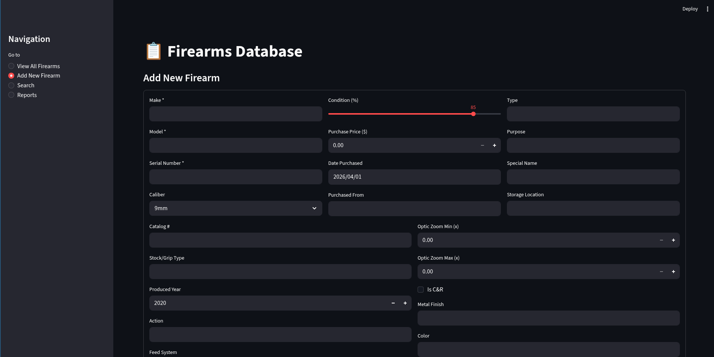
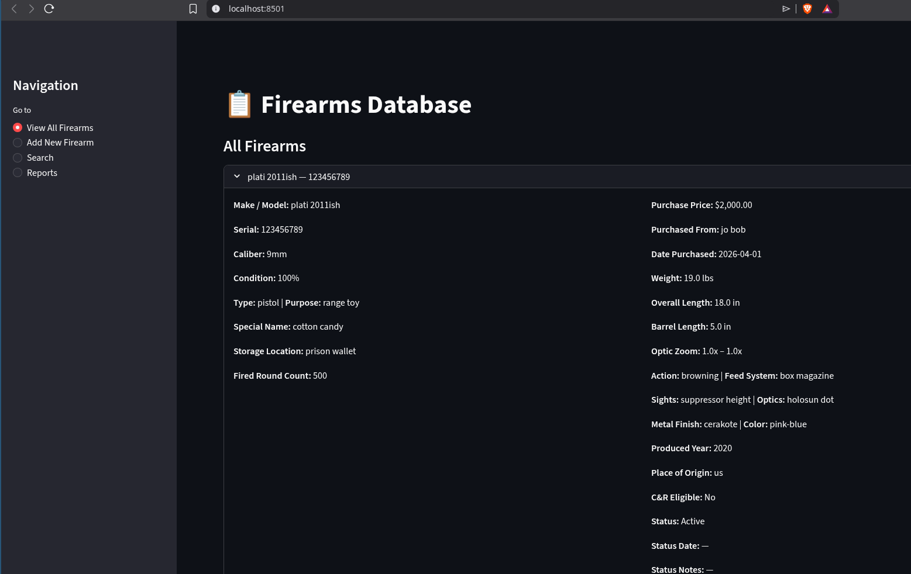
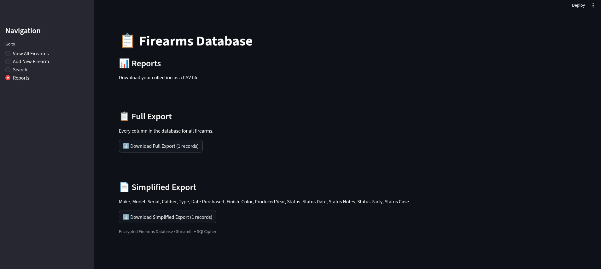

# Firearm Database (Streamlit + SQLCipher)

A secure, encrypted, cross-platform firearms inventory application built with Streamlit, SQLCipher, and Python.

This application creates an encrypted database of firearms, maintenance logs, and pictures.  
It includes a full web interface for adding, editing, searching, and managing your collection.

---

## 🔒 Features

- Fully encrypted SQLCipher database (`firearms_encrypted.db`)
- Add, edit, and view full firearm records with **40+ fields**
- Upload pictures and maintenance notes
- Automatic `created_at` timestamps
- Status workflow:
  - Active
  - Sold
  - Deleted / Archived
  - Stolen
  - Transferred
  - Consigned
- Restore deleted/sold items
- Full detail pages with photos & maintenance logs
- Runs on Windows, Linux, and macOS

---

## 📸 Screenshots

### ➕ Add Firearm


### 🔍 View Firearm


### 📊 Reports Page


---

## 📦 Requirements

- Python 3.10+
- tmux
- SQLCipher (varies by OS)
- Python packages:
  - `streamlit`
  - `sqlcipher3`
  - `pillow`

---

## 🛠️ Installation

### Linux Installation

#### 1. Install SQLCipher

**Ubuntu/Debian:**
```
sudo apt update
sudo apt install sqlcipher libsqlcipher-dev python3-dev tmux
```

**Fedora:**
```
sudo dnf install sqlcipher sqlcipher-devel tmux
```

**Arch:**
```
sudo pacman -S sqlcipher tmux
```

#### 2. Install Python dependencies
```
python3 -m venv venv
source venv/bin/activate
pip install streamlit sqlcipher3 pillow
```

#### 3. Place the app

Put `firearm-db.py` in your project folder.

---

### macOS Installation

#### 1. Install Homebrew (if needed)
```
/bin/bash -c "$(curl -fsSL https://raw.githubusercontent.com/Homebrew/install/HEAD/install.sh)"
```

#### 2. Install SQLCipher
```
brew install sqlcipher
```

#### 3. Install Python dependencies
```
python3 -m venv venv
source venv/bin/activate
pip install streamlit sqlcipher3 pillow
```

---

### Windows Installation

#### 1. Install SQLCipher

Download Windows binaries:

https://github.com/sqlcipher/sqlcipher

Extract to something like:

```
C:\sqlcipher\
```

#### 2. Install Python dependencies
```
python -m venv venv
venv\Scripts\activate
pip install streamlit pillow sqlcipher3-binary
```

If `sqlcipher3` fails, the `sqlcipher3-binary` wheel works.

---

## ▶️ Running the Application

### Linux / macOS
```
source venv/bin/activate
streamlit run firearm-db.py
```
If you want to use tmux.  This activate the virtual env and starts the DB.
```
./tmux-run.sh
```

### Windows
```
venv\Scripts\activate
streamlit run firearm-db.py
```

Then open:

http://localhost:8501

---

## 🗄️ Database Password

The website will prompt you for the password.


---

## 🌐 Using the Web Application

### ➕ Add New Firearm

A complete form with fields for:

- Make, model, serial  
- Description  
- Type / Purpose  
- Special name  
- Caliber (includes “Other” field)  
- Condition %  
- Purchased from / price / date  
- Catalog number  
- Grip type  
- Action / feed / sights / optics / zoom levels  
- Weight, barrel length, OAL, height  
- Produced year  
- Metal finish / color  
- Place of origin  
- C&R eligibility checkbox  
- Notes  
- Fired round count  
- Status (Active/Sold/Deleted/Stolen/Transferred/Consigned)  
- Status metadata depending on selection  

After submitting, the firearm is stored encrypted.

---

## 🔍 Viewing Your Firearms

The home page lists all firearms.

Selecting a firearm expands to show:

- Full details  
- All pictures  
- All maintenance notes  

---

## 🎯 Detail Page

Full detail view includes:

- Make/model  
- Serial  
- Caliber  
- Condition  
- Type/purpose  
- Special name  
- Storage location  
- Fired round count  
- Purchase info  
- Dimensions  
- Optic zoom range  
- Action & feed system  
- Metal finish & color  
- Produced year & origin  
- C&R status  
- Status metadata  
- Notes  
- Maintenance notes  
- Photos  

---

## 🔧 Status / Actions

Each firearm supports:

- ✏️ Edit  
- 💲 Sold  
- 🔁 Transfer  
- 🤝 Consign  
- 🚨 Stolen  
- 🗑️ Delete  
- ↩️ Restore  

Each action may request fields like:

- Status Date  
- Notes  
- Party Name  
- Police Case Number  

---

## 🛠️ Maintenance Notes

You can add:

- Note number  
- Note text  
- Date (defaults to today)  

---

## 📷 Pictures

Uploaded pictures are stored **encrypted** inside the SQLCipher database.

---

## 🔐 Database Security

The database uses:

- Full SQLCipher AES-256 encryption  
- User-defined password  
- WAL mode  
- Foreign key enforcement  
- Secure defaults  

⚠️ Lost password = **permanent loss of data access**

---

## 🧩 Future Enhancements

- PDF export  
- Automatic backups  
- QR code tagging  
- CSV import/export  

---

## 📄 License

This project is licensed under the **GPLv3**.

## Credits
I worked with Grok to start this project, and Claude fixed it and added the finishing touches.
